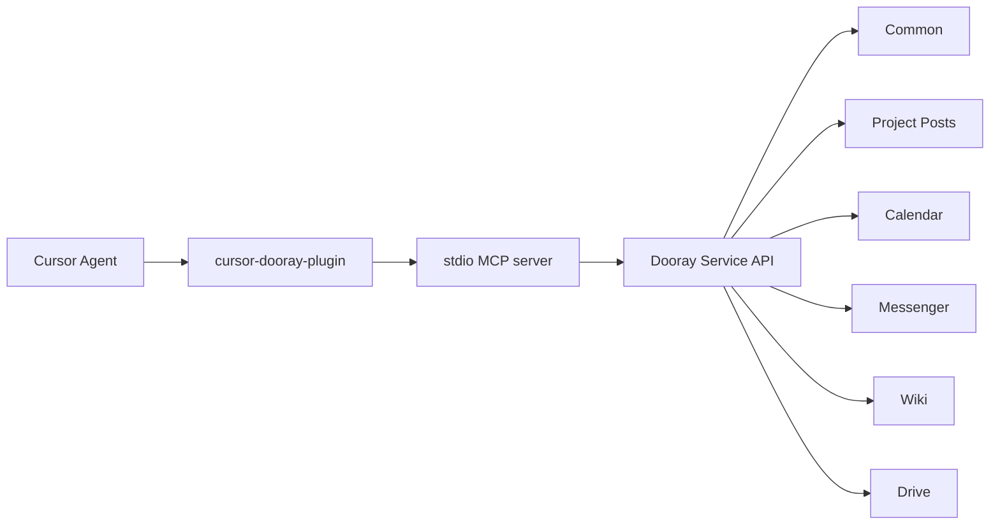

# cursor_dooray_plugin

Cursor에 등록할 수 있는 Dooray 플러그인입니다. 공식 [Dooray 서비스 API](https://helpdesk.dooray.com/share/pages/9wWo-xwiR66BO5LGshgVTg/2939987647631384419)를 MCP 도구로 노출합니다.

Cursor 플러그인 `name`은 kebab-case 제약 때문에 `cursor-dooray-plugin`입니다. 표시 이름은 `cursor_dooray_plugin`입니다.

## 구성



플러그인은 다음을 포함합니다.

- MCP 서버: 공식 REST 경로를 호출하는 stdio 서버 (`dist/server.js`)
- Skills / Commands / Agent / Rule: 두레이 ID 해석과 업무 워크플로
- 변수: `DOORAY_API_TOKEN`, 선택적 `DOORAY_API_BASE_URL`

## 설치

Cursor에서 **폴더로 플러그인 추가**하면 `.cursor-plugin/plugin.json`이 아니라 `.cursor-plugin/marketplace.json`을 찾습니다. 이 저장소는 그 매니페스트를 포함합니다.

1. Cursor **Customize**에서 로컬 폴더로 이 저장소 루트를 추가합니다.
2. `cursor-dooray-plugin`을 설치합니다.
3. **Plugins → Configure**에서 `DOORAY_API_TOKEN`을 넣습니다.

또는 저장소를 `~/.cursor/plugins/local/cursor-dooray-plugin`에 복사하거나 심볼릭 링크한 뒤 창을 다시 로드합니다.

토큰 발급: 두레이 **개인설정 > API > 개인 인증 토큰**. 호출 헤더는 `Authorization: dooray-api {TOKEN}`입니다.

Base URL 기본값은 `https://api.dooray.com`입니다.

| 환경 | `DOORAY_API_BASE_URL` |
| --- | --- |
| 민간 클라우드 | `https://api.dooray.com` |
| 공공 클라우드 | `https://api.gov-dooray.com` |
| 공공 업무망 | `https://api.gov-dooray.co.kr` |
| 금융 클라우드 | `https://api.dooray.co.kr` |

## 사용 예

- "내 두레이 업무 보여줘" → `/dooray-my-tasks`
- "디자인 프로젝트에 버그 티켓 만들어줘"
- "홍길동에게 메신저로 회의 10분 전이라고 보내줘"
- "오늘 캘린더 일정 요약해줘"

전용 도구가 없는 엔드포인트는 `dooray_list_api_catalog`로 경로를 확인한 다음 `dooray_api_call`을 사용합니다. 카탈로그는 공식 서비스 API HTML에서 추출한 138개 경로입니다.

## 개발

```bash
npm install
npm test
npm run build
npm run validate
```

엔드포인트 목록: `docs/dooray-api-endpoints.json`

## 보안

- 토큰은 저장소에 넣지 않습니다. Cursor 플러그인 변수로만 주입합니다.
- 삭제 및 `/delete`, `/set-archive` 호출은 `confirm=true`가 필요합니다.
- 토큰 권한은 발급 계정과 같고, 테넌트 ACL도 동일하게 적용됩니다.
